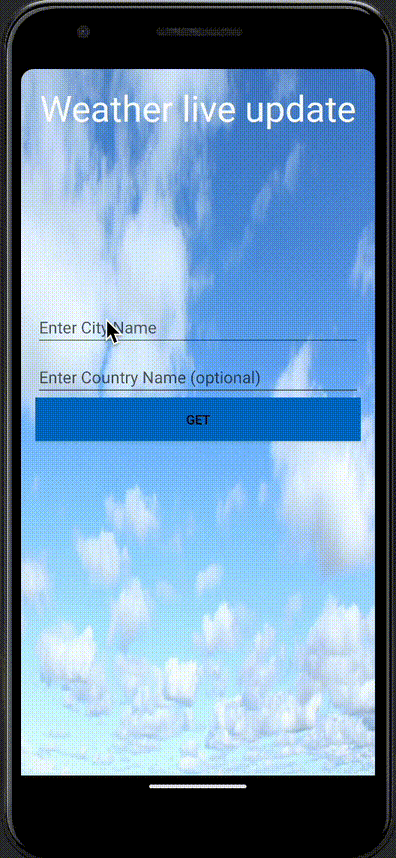
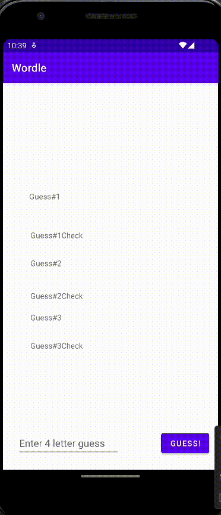
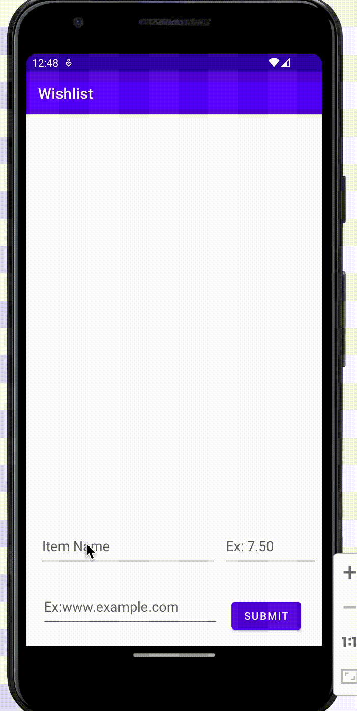

# Code Path: Android

## Projects made in Android Studio and Kotlin 

Hi There! I'm Gloria, and I am excited to share with you the Android application I designed through the Code Path Course. 

I've put together a list of walk-throughs for some of my projects in action. 

[Flixster](https://github.com/gloriadukuzeyesu/Code_Path/tree/main/FlixsterPart1)

[Weather](https://github.com/gloriadukuzeyesu/Code_Path/tree/main/WeatherApp)

[WordleGame](https://github.com/gloriadukuzeyesu/Code_Path/tree/main/WordleGame)

[Wishlist](https://github.com/gloriadukuzeyesu/Code_Path/tree/main/Wishlist)

